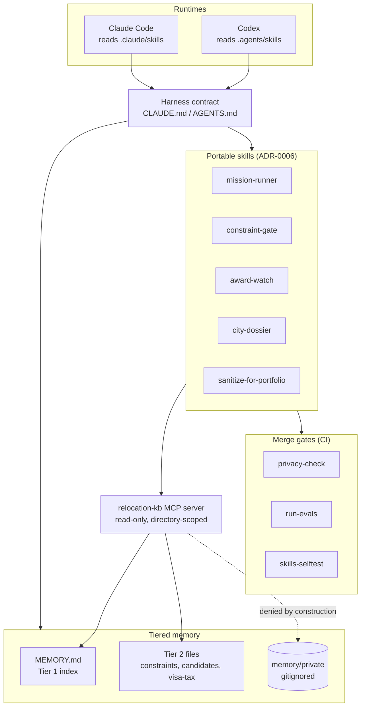
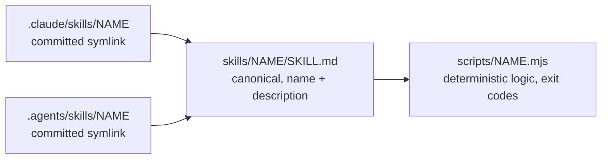
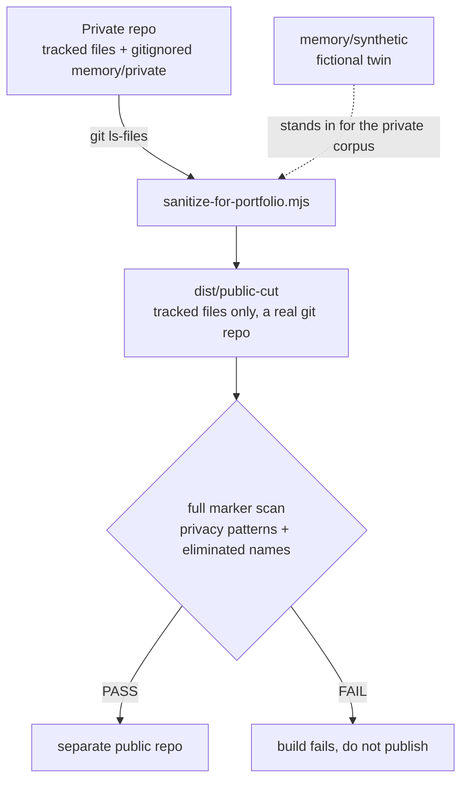

# Relocation OS: Architecture

This is a dual-runtime agentic operating system for one high-stakes personal decision: an
international relocation. It runs identically under Claude Code and Codex. The design goal is
narrow and load-bearing: deterministic orchestration behind a hard privacy boundary, so an
agent can do real research and planning without leaking personal context or freelancing past
decisions that are already locked.

Nothing here is a chatbot wrapper. Every moving part exists to make agent behavior
predictable and reviewable: instructions live in version control, orchestration lives in
scripts, and merge is gated by machine-checkable evals.

## System overview

The harness contract is the root of trust. Both runtimes read the same contract (Claude Code
from `CLAUDE.md`, Codex from `AGENTS.md`, kept in sync as a hard rule). It defines the load
order, the locked decisions, the mission pattern, and the privacy quarantine. An agent that
proposes something conflicting with the contract stops and surfaces the conflict rather than
acting.

## Tiered memory

Memory is loaded by need, not in bulk. `memory/MEMORY.md` is a small always-loaded Tier 1
index. Tier 2 files (the locked-decision registry, the candidate cities, the visa and tax
facts) load only when a task touches their topic. `memory/private/` holds personal context,
is gitignored, and is never quoted into a tracked file. This is the context-economy answer to
the token-inflation problem: the agent pays for what it reads, so the default read is small.

## Retrieval through a scoped MCP server

Instead of dumping memory files into context, sessions retrieve claims through the
`relocation-kb` MCP server. It exposes three read-only tools (`search_claims`, `read_claim`,
`list_topics`), is scoped to the repo directory, and denies `memory/private/` by construction
through a canonicalize-then-verify path gate. Least privilege is the point: the retrieval
surface can read the served scope and nothing else, and it cannot write at all.

## Portable skills

A skill is a thin instruction file plus a deterministic backing script. The model chooses the
skill; the script enforces the rule. One canonical file is discovered by both runtimes through
committed symlinks, so there is exactly one source of truth and zero copy drift.

The five skills: `mission-runner` (run a mission pipeline in order, gates enforced),
`constraint-gate` (validate a plan against the locked-decision registry), `award-watch`
(monitor award options, refuse to book), `city-dossier` (assemble a source-attributed,
freshness-flagged city dossier), and `sanitize-for-portfolio` (build and verify the public
cut). Each ships with a self-test wired into CI.

## Missions and the constraint registry

Each trip or evaluation is a folder under `missions/` with an ordered `pipeline.md` and a
dated `outputs/` directory, one file per step. The constraint math is solved and presented
before any downstream recommendation begins. Booking-adjacent steps refuse to run while hard
gates are unresolved. The registry in `memory/constraints.md` (L1 through L8) holds the locked
decisions: permanent eliminations, the travel ceiling, routing preferences, and the
prerequisites that must clear before anything is booked. Skills surface registry conflicts;
they never resolve them.

## The privacy boundary and the public cut

The whole system is private. The public showcase is a separate artifact, produced
deterministically and proven clean before it is ever published.

The cut copies only tracked files, so `memory/private/` is excluded by construction. A
fictional synthetic twin stands in for the private corpus on the identical schema. The cut is
made a real git repo and its own privacy gate runs against it with the full marker list. Any
marker hit fails the build. A separate public repo, not a branch of the private one, gives the
cut clean history so no commit archaeology leaks. See
[ADR-0007](decisions/ADR-0007-public-cut-and-portfolio-sanitization.md).

## Quality gates

Three checks run on every pull request and block merge: the privacy gate (structural checks
plus a marker scan), the eval suite (mission outputs must conform to schemas and invariants),
and the skills self-test (each backing script asserted against synthetic fixtures). The
decisions behind each subsystem are recorded as ADRs in `docs/decisions/`.
